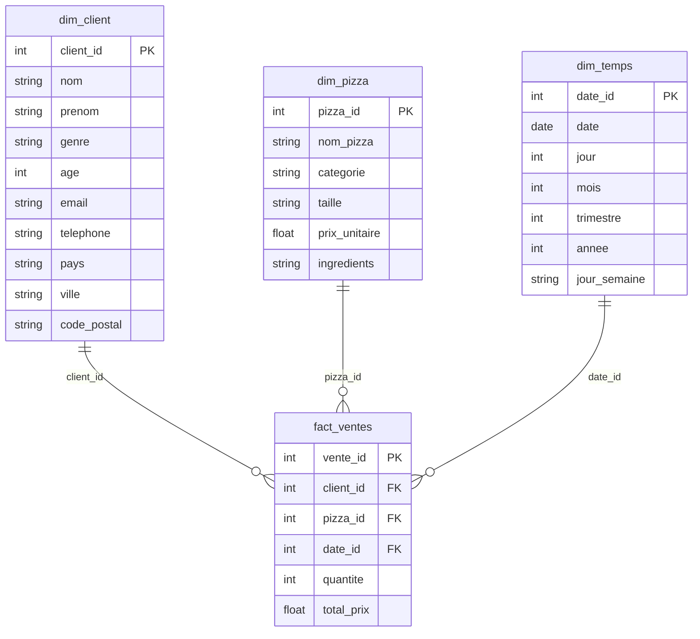

# 🍕 Pizza Data Warehouse Project

## 🎯 Objectif du projet
Ce projet a pour but de construire un **Data Warehouse complet** et un **pipeline ETL automatisé** à partir d’un dataset de ventes de pizzas.  
Il simule un cas réel où une entreprise de restauration souhaite analyser ses ventes et mieux comprendre ses clients.  

## 🏛️ Architecture du projet

- **OLTP (source)** : dataset de ventes de pizzas (CSV).  
- **ETL** : extraction, transformation et chargement avec Python (pandas + SQLAlchemy).  
- **OLAP (cible)** : Data Warehouse en schéma en étoile (fact + dimensions).  
- **BI** : tableau de bord Power BI pour visualiser les KPIs.  

## 📊 Questions business adressées
- Quelles sont les pizzas les plus vendues ?  
- Quels sont mes meilleurs clients ?  
- Quels jours/heures enregistrent le plus de ventes ?  
- Quelle est l’évolution des ventes au fil du temps ?  

## 🛠️ Outils & technologies
- **Python** : pandas, SQLAlchemy (ETL).  
- **SQL** : PostgreSQL ou SQLite (Data Warehouse).  
- **Power BI** (visualisation).  
- **Git/GitHub** (versionning).  

## 🗂️ Structure du repo

```text
pizza-bi-project/
├── data/
│   ├── pizza_sales.csv         # Données sources brutes (ventes)
│   ├── clients.csv             # Données générées (clients)
│   └── pizza_dw.db             # Data Warehouse SQLite final
├── etl/
│   └── load_data.py            # Script complet ETL (Extract – Transform – Load)
├── sql/
│   └── create_schema.sql       # Script SQL de création du schéma en étoile
├── docs/
│   └── schema_star_diagram.png # Diagramme du modèle de données (optionnel)
└── README.md                   # Documentation du projet
```

## 🛣️ Roadmap (provisoire)
- [X] Collecte et préparation des données (pizza_sales.csv + clients.csv)  
- [ ] Modélisation du schéma en étoile (SQL)  
- [ ] Développement du pipeline ETL (Python)  
- [ ] Création du Data Warehouse (PostgreSQL/SQLite)  
- [ ] Tableaux de bord Power BI  
- [ ] Documentation finale + screenshots


## 📂 Datasets disponibles

- **pizza_sales.csv** : dataset des ventes de pizzas (source Kaggle).
- **clients.csv** : dataset fictif généré (9 000 clients) avec noms, prénoms, genre, âge, email, téléphone, pays, ville, code postal.

## ⚙️ Technologies utilisées
| Catégorie              | Outils / Technologies  |
| ---------------------- | ---------------------- |
| Langage                | Python 3               |
| Librairies principales | pandas, sqlite3, faker |
| Base de données        | SQLite                 |
| Environnement virtuel  | `.venv` (Python venv)  |
| Gestion de versions    | Git / GitHub           |
| Visualisation DB       | SQLiteStudio           |


## 🔄 Pipeline ETL

Le pipeline suit les 3 étapes classiques :

1️⃣ Extract (Extraction)

Lecture des données brutes pizza_sales.csv et clients.csv avec pandas.

Vérification et exploration des datasets.

2️⃣ Transform (Transformation)

Nettoyage et formatage des données.

Construction des dimensions :

dim_temps → à partir des dates de commande.

dim_pizza → à partir du catalogue de pizzas.

dim_client → à partir du dataset clients.

Création de la table de faits :

fact_ventes → ventes avec date_id, client_id, pizza_id, quantite, total_prix.

3️⃣ Load (Chargement)

Insertion des 4 tables (dim_temps, dim_pizza, dim_client, fact_ventes) dans la base SQLite pizza_dw.db.

Chargement réalisé via pandas.DataFrame.to_sql().


## Diagramme du schéma en étoile de notre Data Warehouse

Tables de dimensions :

dim_client (client_id, nom, prenom, genre, age, pays, ville, code_postal)

dim_pizza (pizza_id, nom_pizza, categorie, taille, prix_unitaire, ingredients)

dim_temps (date_id, order_date, jour, mois, annee, trimestre, jour_semaine)

Table de faits :

fact_ventes (vente_id, date_id, client_id, pizza_id, quantite, total_prix)

## Relations :

dim_client (1,n) → fact_ventes ← (1,n) dim_pizza
                            ↑
                      dim_temps (1,n)

    


## ▶️ Exécution du projet

🧩 Pré-requis

1. Python installé

2. Créer et activer un environnement virtuel :
python -m venv .venv
.\.venv\Scripts\activate

3. Installer les dépendances :
pip install pandas faker

🏃 Lancer le pipeline
python etl/load_data.py

👉 Résultat attendu :

✅ Connexion établie avec succès : pizza_dw.db
📂 Tables trouvées : [...]
🚀 Démarrage du chargement dans la base SQLite...
✅ Chargement terminé avec succès dans pizza_dw.db !

🧠 Compétences mises en œuvre

Conception d’un schéma en étoile (Star Schema)

Manipulation de données avec pandas

Génération de données synthétiques avec Faker

Création et gestion d’un Data Warehouse SQLite

Automatisation du pipeline ETL complet

Structuration et documentation d’un projet GitHub professionnel

💼 Auteur

👩‍💻 Raïssa — Data Analyst | Future Data Engineer
📅 Projet personnel réalisé dans le cadre d’un apprentissage pratique du Data Warehousing et des processus ETL.

---
🚀 Projet en cours de développement
